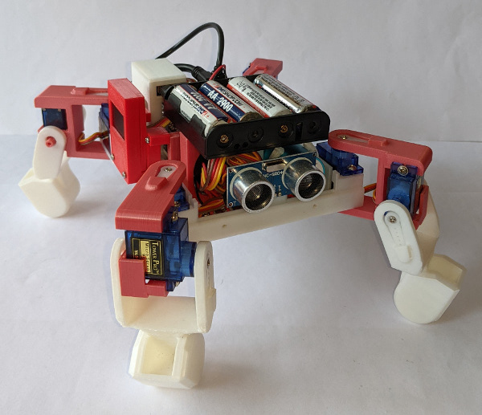

# A Raspberry Pi Zero managed, 4-legged, 8DOF walking robot
## Documentation, example code and related data/image files for an 8 degrees of freedom walking robot managed by a Raspberry Pi Zero

 &nbsp; &nbsp; 

This 'quadrabot' is built using 3D printed components that house:
- the Raspberry Pi Zero controller (a Mk2 version has been used)
- eight small SG90 servo motors managed by a PCA9685 PWM control board
- a set of 3 slide switches used for operational control
- an ultrasonic sensor used for obstacle detection and subsequent avoidance
- a small 128x64 pixel OLED used to display the robot status
- a wireless controller USB 'dongle' that connects to a PiHut wireless controller/gamepad (see <a href="https://github.com/gbrickell/wireless_controller_input" target="_blank" >this link</a> for further details)
- a 22mm diameter rechargeable battery bank that powers the Raspberry Pi, and
- a 4xAA battery holder for 4 rechargeable AA batteries that power the servos

 Full details about the project are published at <a href="https://onlinedevices.co.uk/PiZero+8DOF+walking+robot+overview" target="_blank" >this link</a> and the designs for all the associated 3D printed components can be downloaded from <a href="https://www.printables.com/model/155945-four-legged-8dof-robot" target="_blank">here</a>. It should be noted that the overall assembly has been evolved over an extended period of time with the wireless controller ‘dongle’ holder and OLED 'bolted on' to an earlier overall arrangement, so some 'consolidation' of the 3D print designs would certainly be possible!

The set of code and related material provided here is for a Raspberry Pi Zero computer and the current versions have been developed/tested using the Bullseye OS. 

The quadrabot's servos move the four legs, each with a 'hip' and 'knee' joint where the movement mechanism or 'gait' is best described as a creeping style, and a spreadsheet is provided in the documentation folder that tabulates how a defined set of leg movements are converted into a set of individual servo movements that are then used in the code to create 'walking' functions. Alsoprovided in the documentation folder is a PDF providing detailed build and usage notes.

All the code is assumed to be in a /home/pi/quadrabot/ folder on the Pi, and the main Python code uses a set of slide switches to 'set' and switch on/off a number of different operating modes as follows:
- <b>demo mode</b>: stand-alone operation that runs through a set series of 'moves' 
- <b>autonomous mode</b>: that lets the quadrabot roam on its own using the ultrasonic sensor to detect obstacles with an avoidance algorithm that attempts to steer around the obstacle
- <b>wireless controller mode</b>: allows the quadrabot to be controlled by the PiHut wireless controller, and
- <b>web mode</b>: which uses a Flask web server and associated HTML templates that allow the quadrabot to be controlled from a browser running on another device ('phone, tablet etc.) that is connected to the same WiFi network as the quadrabot.

The Flask web server is run in a separate Python routine on the Pi Zero and it 'talks' to the main Python code via short text messages that are 'written to'/'read from' a ram drive that is set up by the main Python routine. Both the main code and the web code are automatically run on the Raspberry Pi Zero from boot up using a cron.

It should be noted that a small amount of 'C' code is provided, controlled from the Python code, to allow the servos to be driven at the best possible speed. The supplied custom libquadrabot_servo.so code, underpinned by an installed libPCA9685 library (see https://github.com/edlins/libPCA9685 for details), was compiled on a Raspberry Pi Zero 2 - so may need to be recompiled for a different SBC. The compilation command used is as follows:
gcc -shared -o /home/pi/quadrabot/libquadrabot_servo.so -fPIC /home/pi/quadrabot/quadrabot_servo.c -I/usr/local/include -L/usr/local/lib -lPCA9685

The wireless controller functions are underpinned by the cross-platform Python 'inputs' module from <a href="https://github.com/zeth/inputs" target="_blank">here</a>, but for convenience the module code is included.

Additional component Python test routines are also supplied to check out:
- OLED operation (<i>OLED_simple_text.py</i>)
- slide switch operation (<i>switch_test.py.py</i>)
- wireless controller operation (<i>robot_control_all_inputs.py</i>)
- ultrasonic sensor performance (<i>sensor-distance02.py</i>)
- individual servo movement so that settings for each servo can be calibrated and the values in the code adjusted (<i>I2C_servo_test.py</i>)
- walking operaion with each type being run in 'slow motion' so it can be visually checked (<i>walking_tests.py</i>), and
- servo position calibration, allowing the servo horns to be 'locked' onto the servo splined drives at the approriate locations (<i>servo_reset.py</i>)

